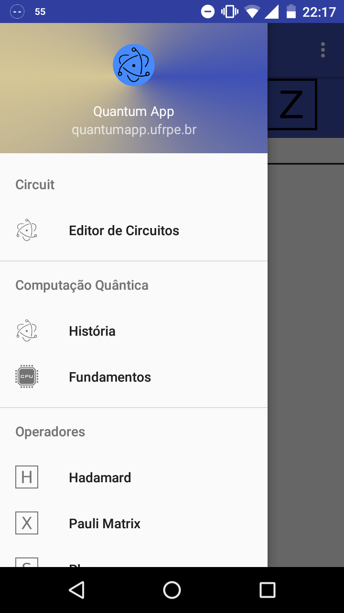

# README #

* Projeto desenvolvido na cadeira de Fundamentos de Programação Aplicada, PPGIA/DEINFO/UFRPE. Implementação de um aplicativo para simulação de Circuitos Quânticos.

* [Leia mais](https://lucianoserafim.bitbucket.io)

### Screenshots ###

* Menu

### Team ###

* Leonardo Souza.
* Luciano Serafim.